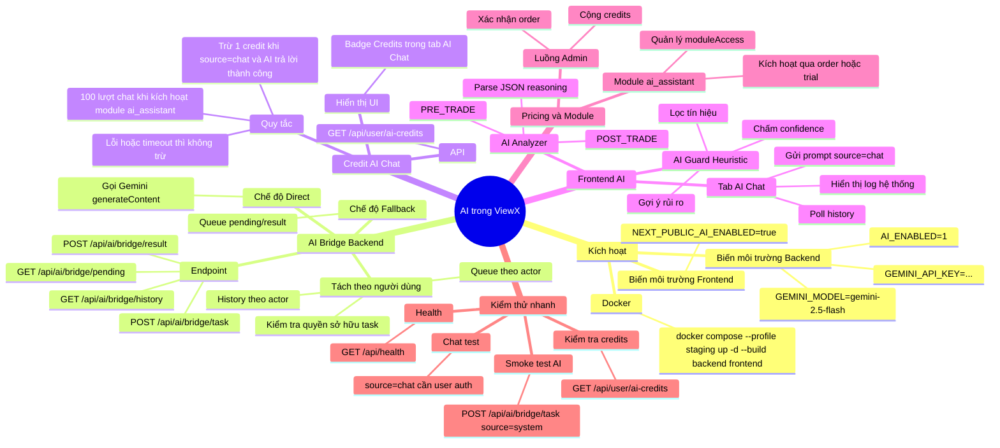

# Mindmap Tính Năng AI (ViewX)

Mở file này trong VSCode để đọc. Nếu bạn dùng extension Mermaid/Markdown Preview Enhanced thì mindmap sẽ hiển thị trực quan.



## Cách sử dụng nhanh

1. Bật biến môi trường AI trong `.env`.
2. Deploy lại Docker với profile `staging`.
3. Đăng nhập user đã có module `ai_assistant`.
4. Mở tab AI Chat và kiểm tra badge `Credits`.
5. Gửi 1 câu chat để xác nhận credit giảm 1 sau khi AI trả lời thành công.

## Lệnh test mẫu (PowerShell)

```powershell
# Health
Invoke-RestMethod http://127.0.0.1:18091/api/health

# AI smoke (service token)
$token=(Get-Content .env | Select-String '^ACCESS_TOKEN=' | % { $_.Line.Substring(13) })
$headers=@{ Authorization = "Bearer $token"; "Content-Type"="application/json" }
$body='{"prompt":"Trả lời chính xác: AI smoke test OK","source":"system","timeout":60000}'
Invoke-RestMethod -Method Post -Uri http://127.0.0.1:18091/api/ai/bridge/task -Headers $headers -Body $body
```

