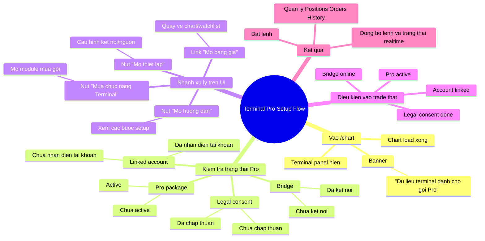

# Terminal Pro Setup Flow (/chart)

## Cach hien thi trong VSCode

1. Mo file nay trong VSCode.
2. Bam `Ctrl+Shift+V` (Markdown Preview).
3. Neu chua render Mermaid, cai extension `Markdown Preview Mermaid Support`.
